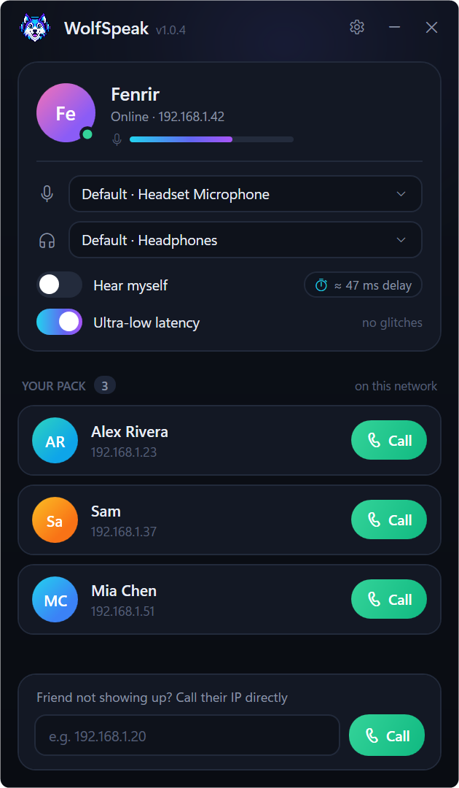
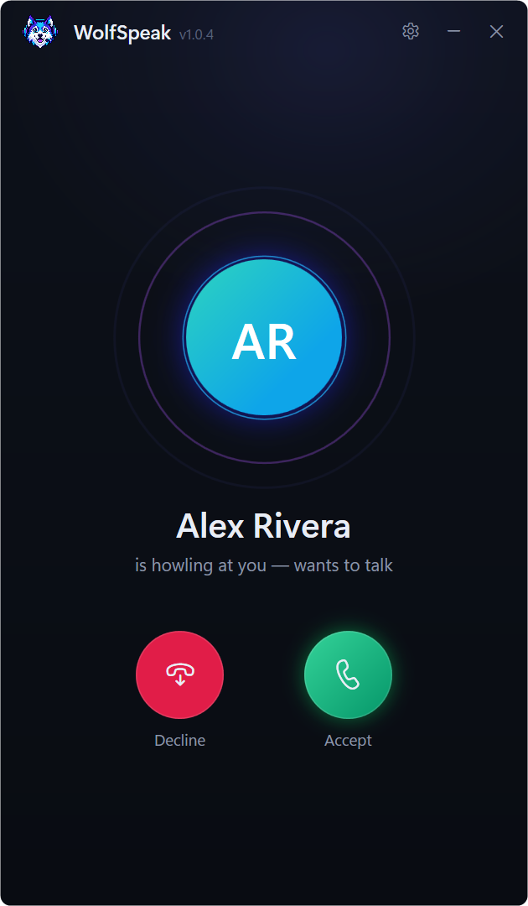
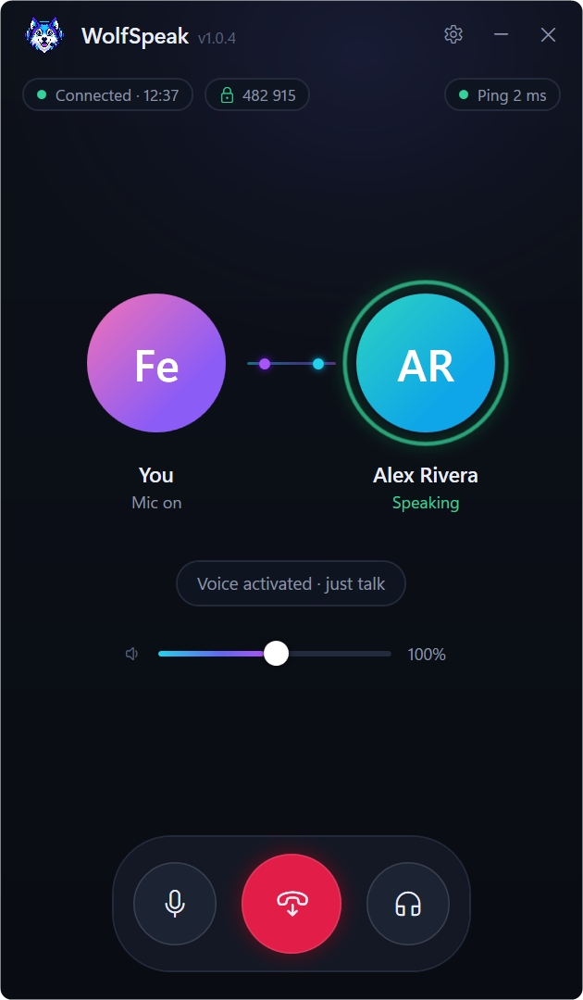
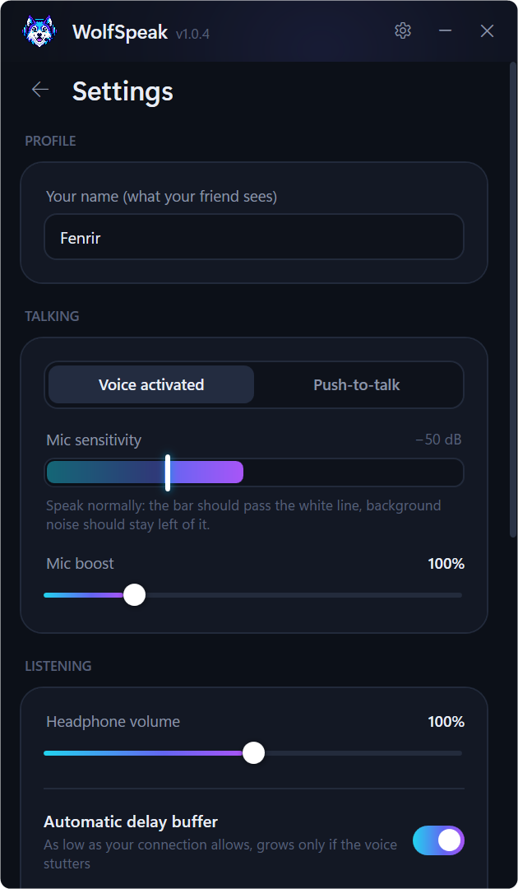

<div align="center">


# WolfSpeak

**Ultra-low-latency voice calls for your local network.**<br>
No servers. No accounts. No codec. Your voice goes straight to your friend's PC in about 40 ms.

[](https://github.com/wolfknight949/wolfspeak/releases/latest)
[](https://github.com/wolfknight949/wolfspeak/releases)


<a href="https://github.com/wolfknight949/wolfspeak/releases/latest/download/WolfSpeak-win-Setup.exe">
  
</a>

<br><br>

&nbsp;
&nbsp;


</div>

---

## Why WolfSpeak?

Discord and TeamSpeak send your voice through a server and squeeze it with a codec. Fine across the
internet, but pointless when your friend is sitting on the same Wi-Fi. WolfSpeak skips all of that.

|                   | Discord / TeamSpeak     | **WolfSpeak**                      |
|-------------------|-------------------------|------------------------------------|
| Route             | You → server → friend   | You → friend, directly             |
| Codec             | Opus (adds 20–60 ms)    | None: raw 48 kHz audio             |
| Mouth-to-ear      | 80–200 ms               | **~40–60 ms**                      |
| Account           | Required                | None                               |
| Works offline     | No                      | Yes, LAN only, no internet needed  |

## Features

<table>
<tr>
<td width="50%" valign="top">

**⚡ Instant, crystal-clear voice**<br>
Raw 48 kHz audio in 5 ms packets, a self-tuning jitter buffer and Windows' low-latency audio mode.

**🔒 Encrypted end to end**<br>
Fresh keys for every call, AES-256-GCM on every packet, and a 6-digit safety code to rule out eavesdroppers.

**🎮 Built for gaming**<br>
Push-to-talk and mute/deafen hotkeys that work while a game has focus, plus real-time audio priority so a busy game doesn't cause dropouts.

</td>
<td width="50%" valign="top">

**🐺 Finds your pack automatically**<br>
Friends on the same network just show up. VPN or another subnet? Call their IP directly.

**🔄 Updates itself, politely**<br>
New versions download in the background. You pick when to restart, and a call is never interrupted.

**🪶 Tiny and quiet**<br>
Lives in the tray, starts with Windows if you like, and pops up when someone calls.

</td>
</tr>
</table>

## Install

1. Download **[WolfSpeak-win-Setup.exe](https://github.com/wolfknight949/wolfspeak/releases/latest/download/WolfSpeak-win-Setup.exe)** and run it.
   No admin rights needed. It also installs the .NET 10 Desktop Runtime if you don't have it.
2. Windows SmartScreen may warn because the installer isn't code-signed: click **More info → Run anyway**.
3. On first launch, Windows Firewall asks about network access: allow **Private networks** (UDP port 50505).

**Updates:** when a new version is ready, a green **Update** button appears at the top. Click it when it
suits you, or it installs next time you quit. **Settings → Check for updates** looks right away.
Calls only connect when both of you run the **same version**. A friend on a different one shows an amber
note in your pack.

## How to use

1. Both of you open **WolfSpeak** on the same Wi-Fi or router.
2. Your friend appears under **Your pack**. Press **Call**.
3. They press **Accept**. Talk. 🎧

> **Friend doesn't appear?** (different subnet, or a ZeroTier / Radmin / Tailscale VPN)
> Type their IP into **Call their IP directly** at the bottom of the home screen. Your own IP is in the top card.

<details>
<summary><b>In a call</b></summary>

- 🎙 **Mute** · ☎ **Hang up** · 🎧 **Deafen** (stop hearing your friend)
- Live ping and packet loss with a quality dot (green / amber / red), and a volume slider for your friend.
- 🔒 **Safety code**: read it to each other once. If it matches on both PCs, nobody is listening in between.
- Hotkeys that work in game: **Ctrl+Shift+M** mute · **Ctrl+Shift+D** deafen.

</details>

<details>
<summary><b>Tray</b></summary>

- Closing or minimizing keeps WolfSpeak in the tray so your pack can still call you.
  Left-click the wolf to open, right-click for Mute / Hang up / Quit.
- The tray wolf shows a dot: 🟢 in call · 🔴 muted · 🟡 ringing.
- An incoming call pops the window up, rings, and shows a Windows notification.
- Optional: **Start with Windows** (starts quietly in the tray).

</details>

<details>
<summary><b>Settings</b></summary>



- **Microphone / Headphones**: pick your headset.
- **Voice activated / Push-to-talk**: PTT works globally, even while a game has focus
  (Mouse 4/5, Caps Lock, Alt, V, …).
- **Mic sensitivity**: drag the white line so your voice passes it but background noise doesn't.
- **Hear myself**: mic test through the same path your friend hears.
- **Delay buffer**: automatic by default. As low as your connection allows, it grows only if the voice stutters.
- Use headphones: there's no echo canceller (it would add delay), so speakers would echo back to your friend.

<br clear="right">
</details>

## Security

- **Every call is encrypted.** Each call starts with fresh P-256 keys, signed by each PC's identity key
  (stored DPAPI-protected in `%APPDATA%\WolfSpeak`). Every packet in the call (audio, ping, hang-up) is
  AES-256-GCM encrypted and authenticated, with replay protection. It costs about 1 µs per packet.
- **Nobody can hijack a call.** Spoofed packets can't listen in, inject audio, redirect or end it.
- **Safety code + key memory.** The 6-digit code matches on both PCs unless someone is relaying the call.
  WolfSpeak also remembers each friend's key and warns if it changes.
- **Discovery is open by design.** Anyone on your network can see your WolfSpeak name and ring you, but
  nobody connects until you press **Accept**. Pick a nickname in Settings if you'd rather not show your
  Windows username.

<details>
<summary><b>How it works under the hood</b></summary>

- **Discovery:** a UDP broadcast "hello" every second on port 50505 (plus unicast to saved IPs), carrying
  your name and app version.
- **Calls:** tiny signed handshake packets, repeated until answered, since UDP can drop packets.
- **Audio:** WASAPI capture → 5 ms frames of 16-bit PCM → one encrypted UDP packet per frame (~0.9 Mbit/s).
  The receiver's jitter buffer drops old audio if it ever lags, so delay can't creep up.
- **Mic chain:** 80 Hz high-pass (DC offset, rumble, desk thumps, mains hum) → soft limiter (boost never hard-clips).
- **Voice gate:** 5 ms pre-roll so first syllables aren't cut, fades at the edges of speech (no clicks),
  and a 300 ms hangover so word endings aren't chopped.
- **Packet loss concealment:** a lost packet is covered by repeating the last audio with a fast fade. The
  sender marks "end of speech" so real silence isn't treated as loss.
- **Clock-drift compensation:** two sound cards never run at exactly the same speed, so playback runs
  1% faster while the buffer is over target. It's inaudible, and delay never grows.
- **Real-time priority:** audio threads use Windows MMCSS "Pro Audio", and packets are tagged DSCP EF
  (voice) for QoS-aware routers.
- **Hot-plug:** unplugging a headset or changing the Windows default device reconnects audio automatically.

</details>

## Development

Requires the **.NET 10 SDK** on Windows.

```bash
.\scripts\build.ps1 -Run
```

Quit the installed WolfSpeak first: both use the same single-instance lock and UDP port.

```
WolfSpeak.slnx
src/                    the app (C# / WPF)
  assets/               icon + artwork
docs/screenshots/       README images (made by scripts/screenshots.ps1)
scripts/
  build.ps1             build (-Run to launch)
  release.ps1           installer + auto-update packages (Velopack) → publish/releases
  publish.ps1           loose single-file exe → publish/<runtime>
  screenshots.ps1       README screenshots from the app's demo mode
  make-icon.ps1         regenerates assets/wolfspeak.ico from wolfspeak-icon.png
.github/workflows/      CI release on tag push
CHANGELOG.md            release notes, one section per version
```

<details>
<summary><b>Releasing a new version</b></summary>

1. Bump `<Version>` in `src/WolfSpeak.csproj` (e.g. `1.0.5`).
2. Add a `## [1.0.5] - <date>` section to [`CHANGELOG.md`](CHANGELOG.md). It becomes the release notes,
   and the release fails without it.
3. Commit, then tag and push:

```bash
git tag v1.0.5
```

```bash
git push origin main --tags
```

The **Release** GitHub Action builds the installer and publishes the GitHub Release. Every installed
WolfSpeak downloads it within the hour (within 5 minutes when it sees a friend already on the new version)
and shows the **Update** button.

To build a release locally instead, run `.\scripts\release.ps1` (add `-Upload` with `$env:GITHUB_TOKEN`
set to publish it). Updates come from GitHub Releases, so the repository must stay **public**.

</details>

<details>
<summary><b>Screenshots and demo mode</b></summary>

`WolfSpeak.exe --demo home|ringing|call|settings` runs the real UI with made-up friends and a made-up
call. It uses no network and no audio devices, and never touches your settings.
`.\scripts\screenshots.ps1` captures each scene into `docs/screenshots/`.

</details>

<details>
<summary><b>Loose exe (no installer, no auto-update)</b></summary>

```bash
.\scripts\publish.ps1 -All -Zip
```

Produces `publish\win-x64\WolfSpeak.exe` (needs the .NET 10 Desktop Runtime) and
`publish\win-x64-standalone\WolfSpeak.exe` (runs anywhere). Or double-click `publish.cmd`.

</details>

<details>
<summary><b>Source files</b> (in <code>src/</code>)</summary>

| File | What |
|------|------|
| `VoiceEngine.cs` | network, discovery, call signaling (+ version check), audio capture/playback |
| `CallCrypto.cs` | identity key, signed call handshake, AES-GCM packet encryption |
| `JitterBuffer.cs` | playout buffer: jitter, drift compensation, loss concealment |
| `AudioDsp.cs` | high-pass filter, soft limiter, fades, MMCSS thread priority |
| `LowLatencyAudio.cs` | WASAPI low-latency capture and playback |
| `DeviceWatcher.cs` | audio device plug/unplug notifications |
| `MainWindow.xaml(.cs)` | UI: home, ringing, in-call, settings |
| `App.xaml` | theme: colors, wolf logo, control styles |
| `TrayIcon.cs` | tray icon, status dot, dark menu |
| `Updater.cs` | background updates from GitHub Releases |
| `Demo.cs` | demo mode for screenshots |
| `Program.cs` | entry point; runs Velopack install/update hooks first |
| `Autostart.cs` | "Start with Windows" (per-user Run key) |
| `SoundPlayer.cs` | synthesized ring / connect / hang-up sounds |

</details>
